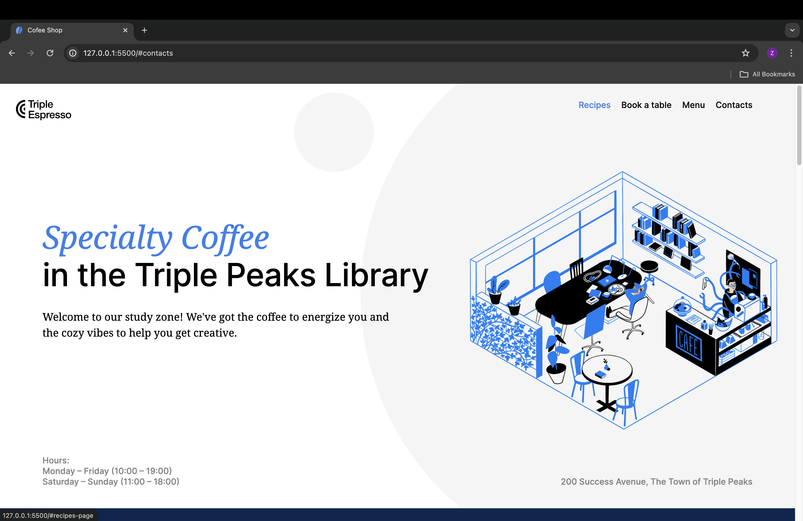
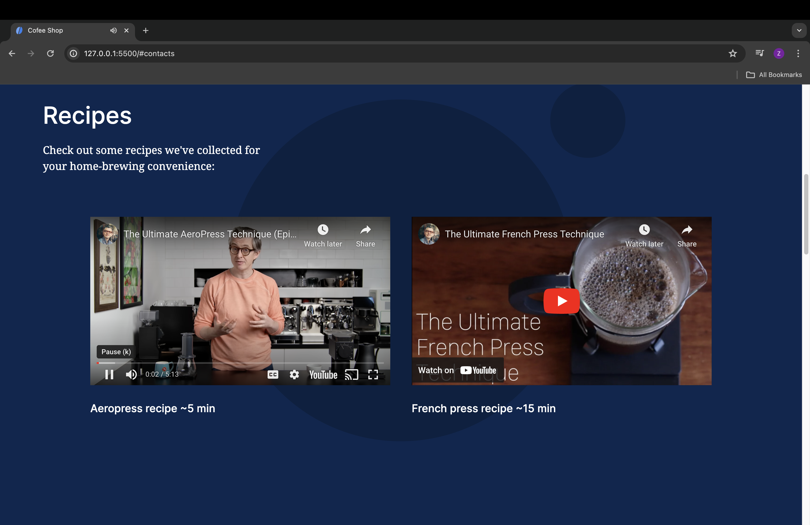
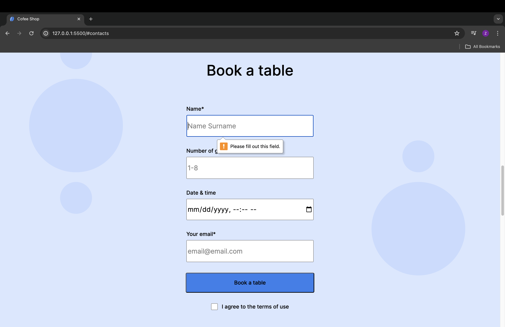
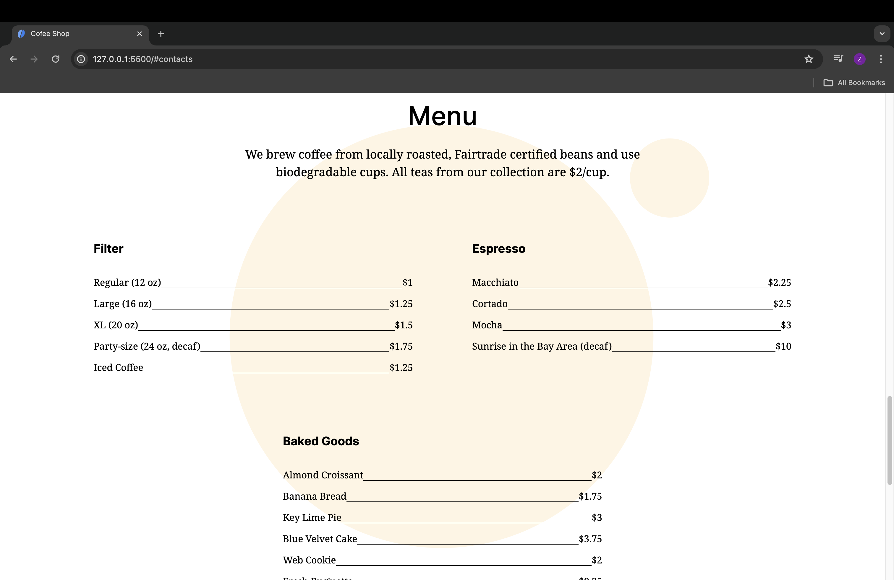
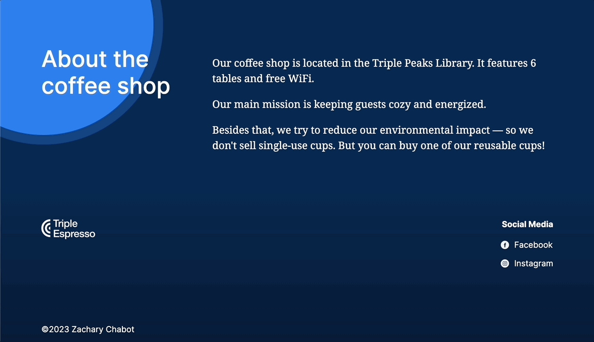

# Triple Peaks Coffee Shop

This is the second project of the Software Engineering program at TripleTen. It was created using HTML and CSS, based on the design brief.

## Project features

- Semantic HTML5
- Flexbox
- Positioning
- Flat BEM file structure
- A custom form
- CSS animation and transform

## Demo images

## Improvement

At least one part of this project I would like to improve on is some of the layouts shrinking to better fit different sized screens. The header image is a good example. I would like to make the image and other elements shrink in proportion with the size of the screen they are on rather than having the header text overlap the image.
